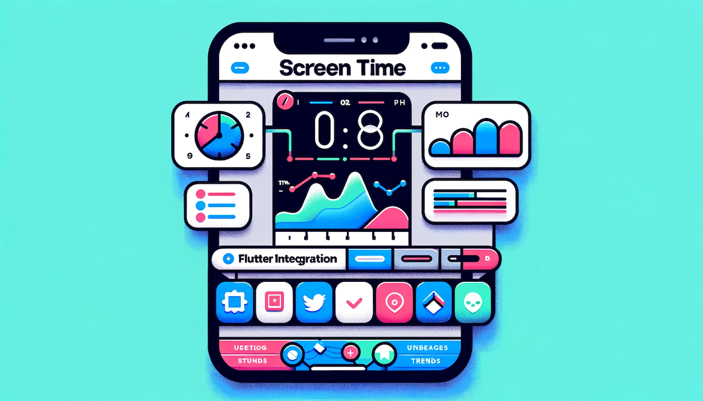
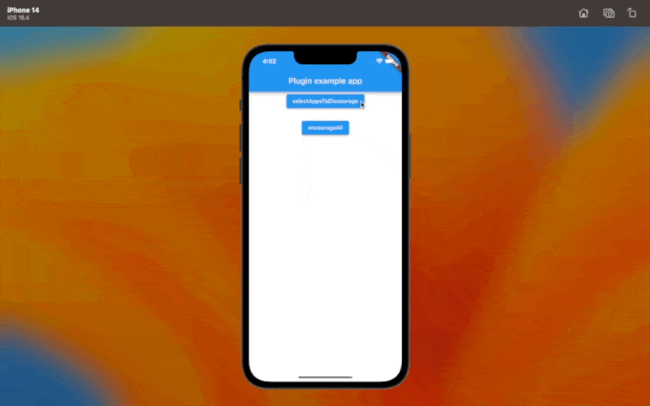
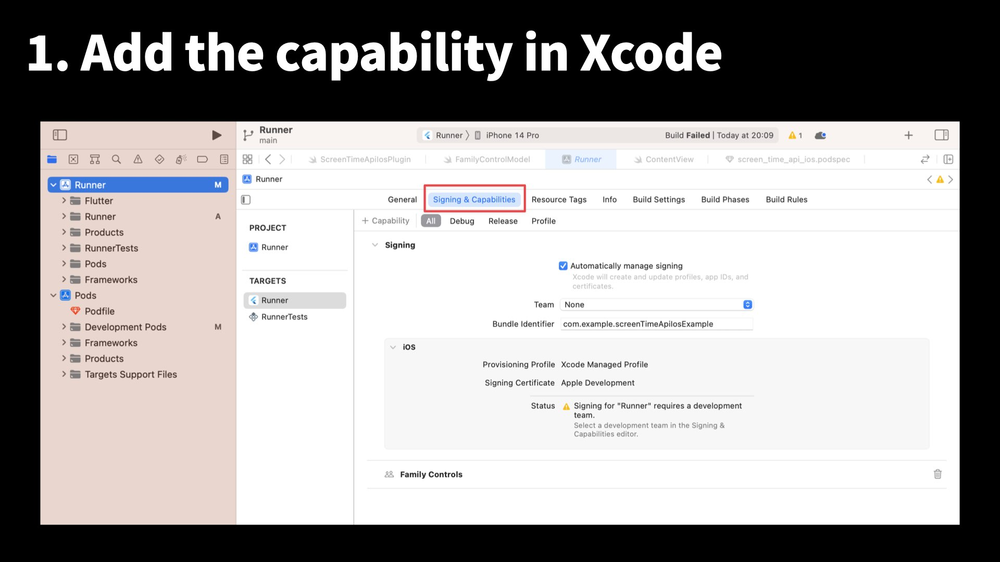
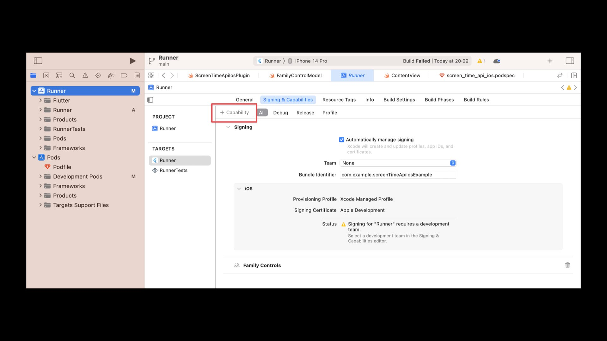
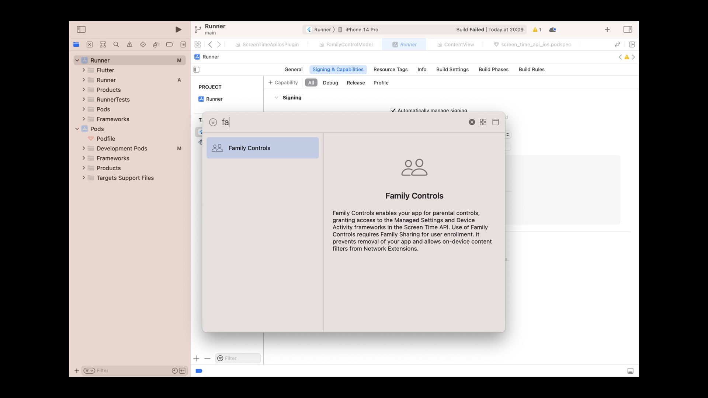
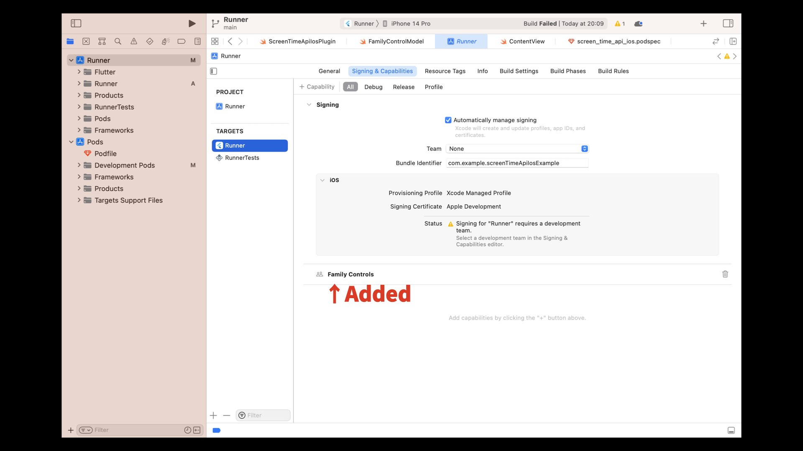
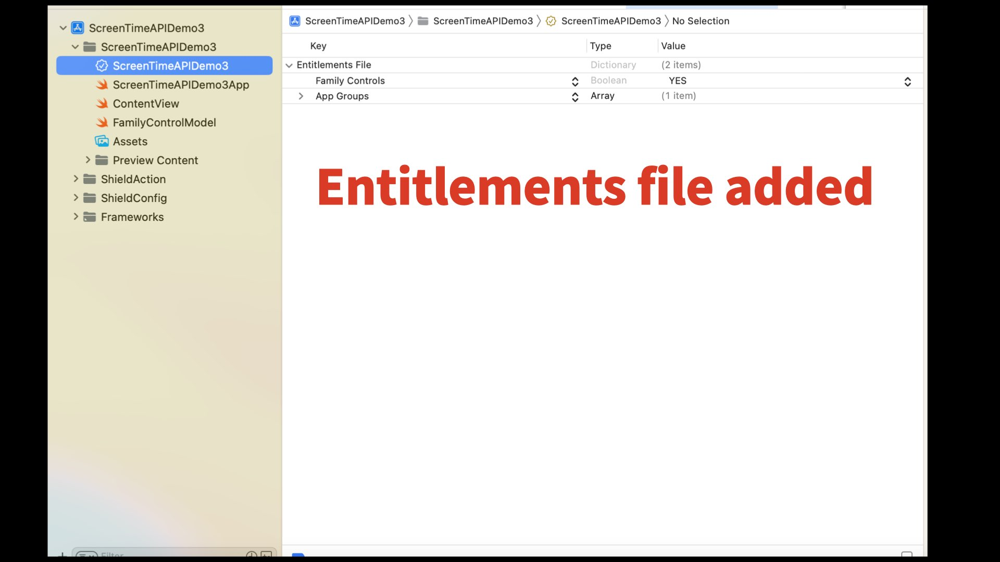
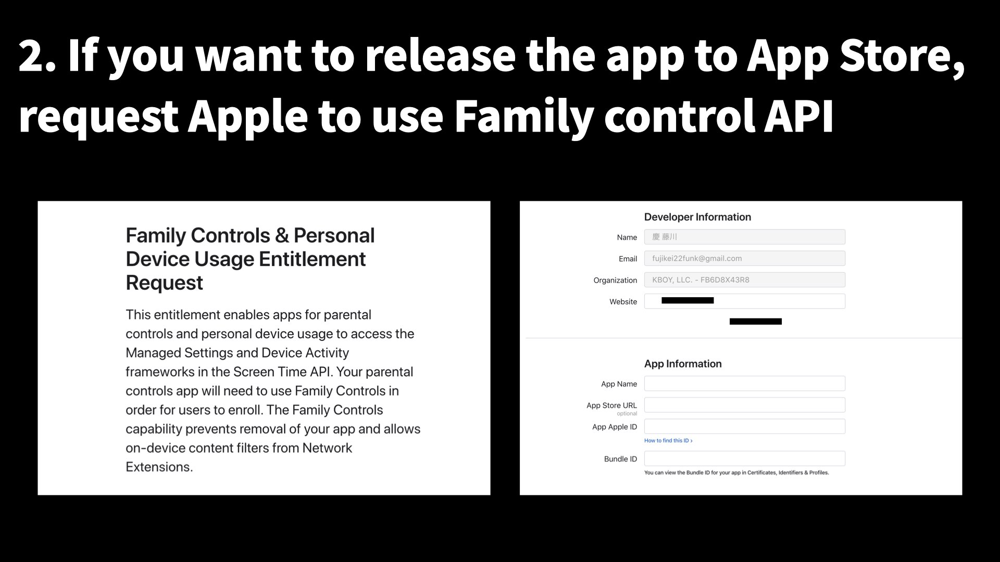

# Screen Time API plugin for Flutter
A Flutter plugin for using Screen Time API. Only iOS is supported.

# What is iOS Screen Time API?
- [Screen Time | Apple Developer Documentation](https://developer.apple.com/documentation/screentime)
- [Meet the Screen Time API - WWDC21 - Videos](https://developer.apple.com/videos/play/wwdc2021/10123/)
- [What's new in Screen Time API - WWDC22 - Videos](https://developer.apple.com/videos/play/wwdc2022/110336/)

# Features
* Show the screen selecting apps to discourage.
* Show all apps from discouraging.



# Getting Started

### 1. Add the capability in Xcode











### 2. Request apple to use Family Control API




# Usage

### select apps To discourage

```dart
final _screenTimeApiIosPlugin = ScreenTimeApiIos();
_screenTimeApiIosPlugin.selectAppsToDiscourage();
```

### Encourage all apps (Release restrictions)

```dart
final _screenTimeApiIosPlugin = ScreenTimeApiIos();
_screenTimeApiIosPlugin.encourageAll();
```

# Contributing to this plugin
This plugin's features are not enough. Please contribute to this plugin! 🙏